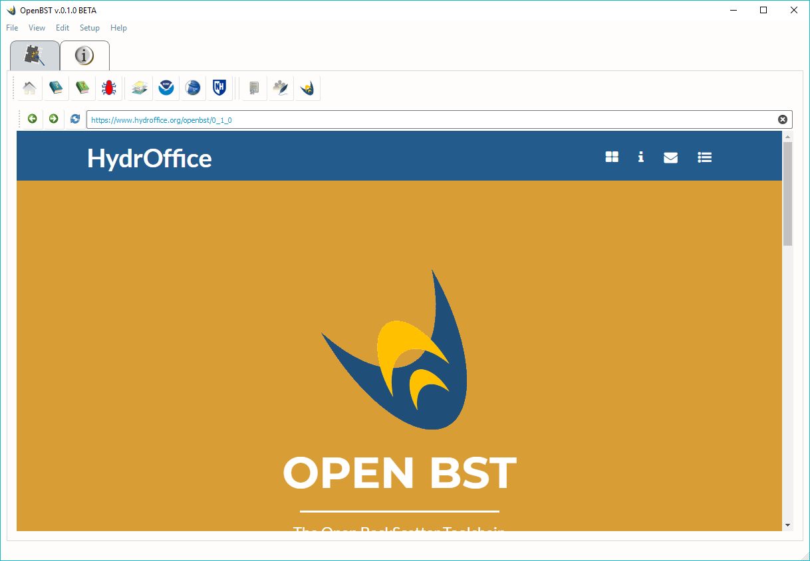

.. _info_tab:

Info Tab
========

The *Info* tab (:numref:`openbst_info_tab`) contains numerous helpful links and utilities:

	* The application home page
	* The Online User Manual (it requires an Internet connection)
	* The Offline User Manual (in PDF format, it does *not* require an Internet connection)
	* A Bug Report form (it is the suggested mean to submit a possible bug in the application)
	* The HydrOffice home page
	* The NOAA Office of Coast Survey home page
	* The Center for Coastal and Ocean Mapping home page
	* The University of New Hampshire home page
	* The License information
	* The Contacts information and the Authors List
	* An About dialog (with details on the local environment where the application is running)

|

.. _openbst_info_tab:

    The OpenBST *Info* tab.
